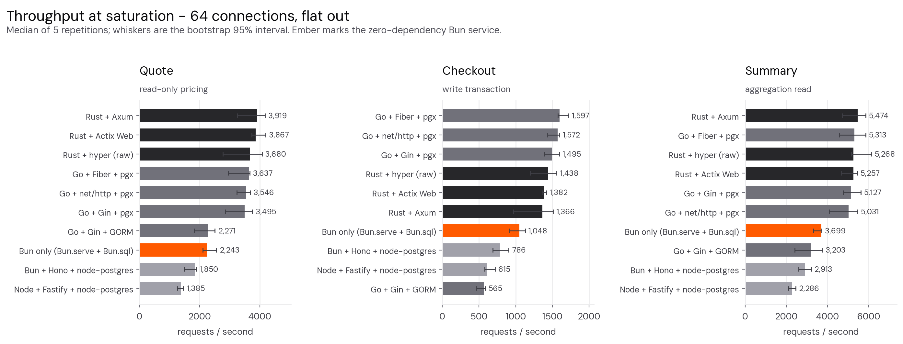
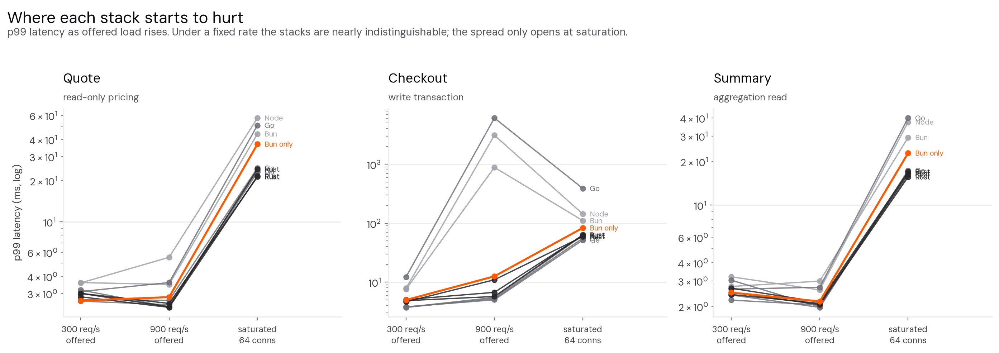
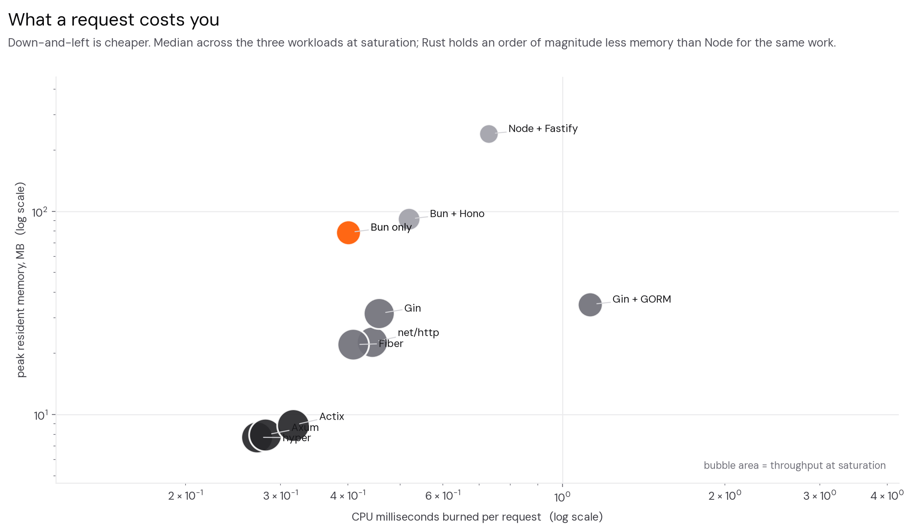
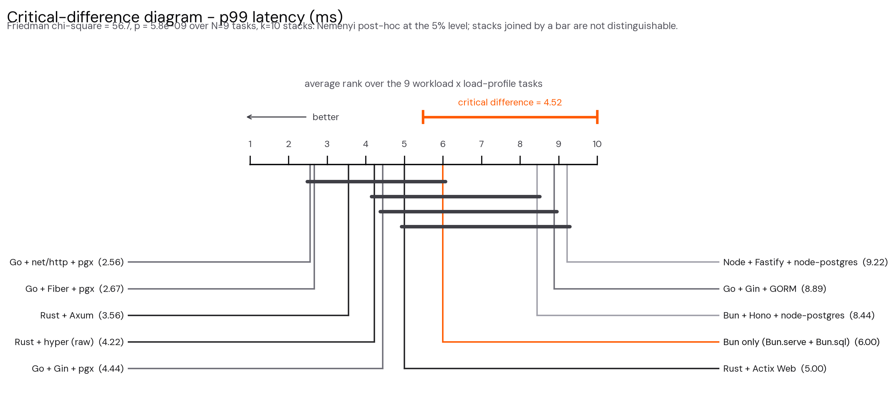
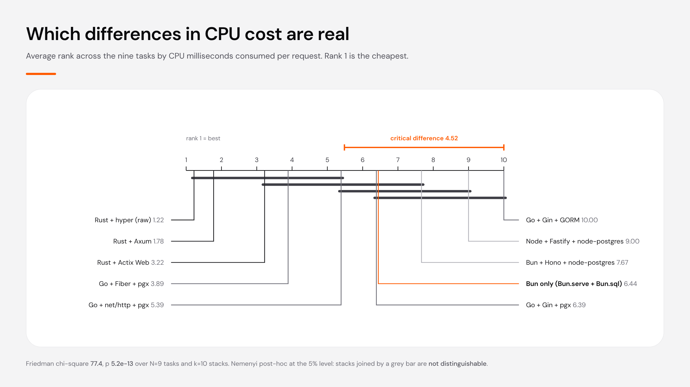
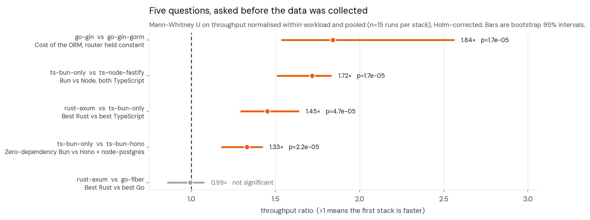
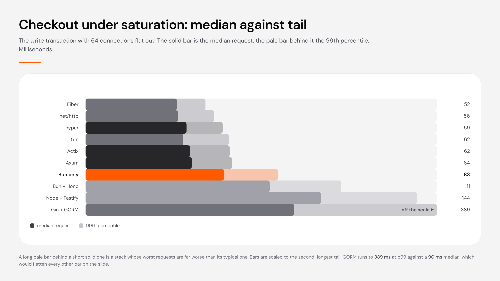

# Polyglot Checkout Bench

*Python is slow.* *Rewrite the backend in Rust and it will be fast.*

Both of those are true. Neither tells you whether it matters on an ordinary
Tuesday, on the service you actually maintain.

The benchmarks people cite do not settle it either. Most of them load-test a
single endpoint that returns a fixed string or serialises one small object,
scaled across a cluster until the requests-per-second number looks impressive.
Very little production code looks like that. What the rest of us ship opens a
transaction, reads half a dozen tables, applies pricing rules that accumulated
over three years of edge cases, writes to several more tables and commits. It
spends most of its wall-clock time waiting on a database rather than executing
its own instructions, and that is the regime the hello-world numbers say
nothing about.

So this benchmarks the thing engineers actually build: order pricing and
checkout for an ecommerce API. Six reads, a discount engine with stacking rules
and coupons, then an eleven-statement write transaction that locks stock and
books the order.

One specification. Ten implementations across TypeScript, Go and Rust. Every
one proved byte-for-byte identical before a stopwatch started, then measured
under identical load, with statistics that say which of the differences are
real and which are noise.



## The short answer

At a fixed 300 requests per second — 26 million calls a day, more than most
businesses ever serve — the ten stacks are separated by
**1.0 ms of p99 latency**, from
2.64 ms (`go-nethttp`) to 3.60 ms
(`ts-bun-hono`). At that load the runtime is not the variable. Your query plans are.

What the compiled stacks buy is headroom and memory, not response time. Pushed
until they break, Rust and Go serve 1.45x
[1.30–1.64] more requests than the
fastest TypeScript stack, and Rust holds around
8 MB resident where Node
holds 243 MB for the
same work.

Three results that hold across every workload and load profile:

- **Rust and Go are statistically indistinguishable here.**
  `rust-axum` against `go-fiber` is 0.99x
  [0.86–1.07], p=0.71.
  On a workload dominated by database round-trips, the gap people expect does
  not appear.
- **Dropping to zero dependencies made the TypeScript service faster.**
  `ts-bun-only` — `Bun.serve`, `Bun.sql`, a sixty-line router, no `node_modules` —
  beats Hono + node-postgres by 1.33x
  [1.18–1.42] and Node + Fastify by
  1.72x [1.51–1.83].
- **The ORM costs more than the language.** `go-gin` and `go-gin-gorm` differ only
  in their data layer: 1.84x
  [1.54–2.56] throughput, and
  2.87 ms of CPU per
  checkout against 0.83 ms.
  Choosing GORM costs more than choosing TypeScript over Go.

## The ten stacks

| id | Language | Framework | Driver |
|---|---|---|---|
| `ts-bun-only` | TypeScript | hand-rolled router | Bun.sql (built in, zero deps) |
| `ts-bun-hono` | TypeScript | Hono | pg (npm) |
| `ts-node-fastify` | TypeScript | Fastify | pg (npm) |
| `go-nethttp` | Go | net/http (stdlib) | pgx/v5 |
| `go-fiber` | Go | Fiber (fasthttp) | pgx/v5 |
| `go-gin` | Go | Gin | pgx/v5 |
| `go-gin-gorm` | Go | Gin | GORM |
| `rust-hyper` | Rust | hyper (none) | tokio-postgres |
| `rust-axum` | Rust | Axum | tokio-postgres |
| `rust-actix` | Rust | Actix Web | tokio-postgres |

Within each language the pricing engine is one shared module, so the framework
rows differ only by the framework. Two rows are deliberate exceptions:
`go-gin-gorm` reaches the same logic through an ORM, and `ts-bun-only` has no
third-party dependency at all — copy the folder, run `bun run src/server.ts`,
and it serves.

## The workload

Defined once in [`spec/SPEC.md`](spec/SPEC.md) and implemented to the letter by
all ten. It is a composite business transaction, not a micro-benchmark:

**`POST /api/quote`** — six reads, then a pricing engine that evaluates every
active discount rule against every cart line, resolves stacking (the largest
non-stackable rule plus all stackable ones, capped at 60% of the line), applies
a coupon pro rata across lines with remainder cents going to the largest line,
recomputes per-line tax on the reduced amount, bands shipping by total weight
and awards loyalty points. Integer cents throughout; no floating point touches
a price.

**`POST /api/checkout`** — the same engine inside one transaction that takes
`SELECT ... FOR UPDATE` on inventory in product-id order, rejects short stock
with a 409, then writes the order, a multi-row line insert, per-line inventory
reservations, two ledger entries, a coupon usage bump and a loyalty transaction
before committing.

**`GET /api/customers/:id/summary`** — four reads over the customer's last 50
orders and their lines, aggregated in process into lifetime value, top
categories by spend, points balance and a segment.

Against 50,000 customers, 5,000 products, 200,000 historical orders and 600,000
order lines.

## Conformance comes first

```bash
python3 bench/verify.py
```

Replays a fixed corpus against all ten services and diffs the canonical JSON.
A stack that computed a different invoice, skipped a query, or rounded
differently fails here before any stopwatch starts. Two normalisations are
applied and both are documented in the script: `orderId`, which is a sequence
and differs per run, and ISO timestamp spelling, since `:00Z` and `:00.000Z` are
the same instant and the spec does not dictate fractional-second formatting.

All ten pass.

## Results

### Under fixed load the stacks converge



### What a request costs



### Statistics

Ten treatments measured over nine tasks (three workloads x three load profiles)
is the design Demsar's framework was built for: significance comes from the
number of tasks, not from repeating the same measurement. The Friedman test
rejects the null decisively for p99 latency
(chi-square = 56.7, p = 5.8e-09) and for CPU per request
(chi-square = 77.4, p = 5.2e-13).

The Nemenyi post-hoc critical difference is 4.52
ranks. Stacks joined by a bar below are not distinguishable at the 5% level:





Five contrasts were specified before the data was collected, each answering one
question. Throughput is normalised within each workload and pooled, giving 15
independent runs per stack, and tested with Mann-Whitney U under Holm
correction:



### Tail behaviour on the write path



### Tables

Throughput at saturation, requests per second:

| stack | Quote | Checkout | Summary |
|---|---|---|---|
| `rust-axum` | 3,919 | 1,366 | 5,474 |
| `rust-actix` | 3,867 | 1,382 | 5,257 |
| `rust-hyper` | 3,680 | 1,438 | 5,268 |
| `go-fiber` | 3,637 | 1,597 | 5,313 |
| `go-nethttp` | 3,546 | 1,572 | 5,031 |
| `go-gin` | 3,495 | 1,495 | 5,127 |
| `go-gin-gorm` | 2,271 | 565 | 3,203 |
| **`ts-bun-only`** | 2,243 | 1,048 | 3,699 |
| `ts-bun-hono` | 1,850 | 786 | 2,913 |
| `ts-node-fastify` | 1,385 | 615 | 2,286 |

p99 latency at a fixed 300 req/s, milliseconds:

| stack | Quote | Checkout | Summary |
|---|---|---|---|
| `go-nethttp` | 2.64 | 3.74 | 2.40 |
| **`ts-bun-only`** | 2.66 | 4.99 | 2.49 |
| `go-gin` | 2.71 | 3.76 | 3.03 |
| `rust-axum` | 2.84 | 4.86 | 2.50 |
| `rust-actix` | 3.00 | 5.07 | 2.67 |
| `rust-hyper` | 3.00 | 4.64 | 2.41 |
| `go-gin-gorm` | 3.10 | 12.28 | 2.63 |
| `go-fiber` | 3.18 | 3.82 | 2.21 |
| `ts-node-fastify` | 3.58 | 7.91 | 3.20 |
| `ts-bun-hono` | 3.60 | 7.60 | 2.75 |

Full tables for every workload and load profile are in
[RESULTS.md](RESULTS.md).

## Method

**Hardware.** Intel Core i7-8665U, 4 physical cores / 8 threads, 31 GB RAM,
Arch Linux, kernel 7.1.9. The CPU governor is pinned to `performance` for the
duration; on the default `powersave` governor the same suite produced a 66%
median spread across repetitions, against 58 of
450 runs flagged as degraded here.

**Core pinning.** The three parties never share a core:

| | cores |
|---|---|
| PostgreSQL 18 (Docker, `cpuset: "0-2"`) | 0–2 |
| service under test (`taskset`) | 3–5 |
| load generator (`taskset`) | 6–7 |

**Database.** PostgreSQL 18 in Docker with a fixed configuration
(`shared_buffers=4GB`, `synchronous_commit=off`, `max_connections=400`), pinned
to its own cores, restored to seeded state before every single run.
`synchronous_commit=off` is a benchmark choice: it removes SSD commit stalls
that would otherwise dominate the write scenario. It is not a durability
recommendation. Autovacuum is disabled on the six churn tables and the vacuum
runs explicitly between runs, because autovacuum firing mid-measurement was the
largest source of noise in an earlier iteration of this suite.

**Load generation.** A purpose-built generator (`bench/loadgen`) runs in two
modes. Closed-loop holds 64 connections and sends as fast as the server answers,
finding the saturation ceiling. Open-loop schedules requests at a fixed arrival
rate and measures latency **from each request's intended send time**, so a
server that falls behind cannot hide it behind its own slowness — the
coordinated-omission correction. Warmup is excluded from statistics, so
JIT-compiled runtimes are not charged for their first few thousand requests.

**Run discipline.** 5 repetitions of 10s after
3s warmup, 450 runs in total. Run order is shuffled
within each repetition so thermal drift cannot systematically favour whichever
stack went first. Every run carries a machine-speed probe — fixed CPU work,
timed — so a run taken while the box was busy is identifiable in the data
rather than silently folded into a stack's score.

**Reproducibility.** The dataset is generated deterministically from a fixed
seed (`db/seed.py`, seed 20260921) and the request corpus likewise
(`bench/corpus.py`, seed 777). Both are regenerable from scratch. Every run
writes a standalone JSON file with its full latency distribution, per-second
timeseries and resource sample; `analysis/stats.py` and `analysis/figures.py`
rebuild every number and every figure in this README from those files.

## Reproducing it

```bash
python3 db/seed.py && ./db/load.sh        # build and load the dataset
cd services/go   && go build -o bin/nethttp ./cmd/nethttp   # and fiber, gin, gingorm
cd services/rust && cargo build --release
cd services/ts   && bun install           # only for the Hono and Fastify services

python3 bench/verify.py                   # prove the ten are equivalent
python3 bench/run.py --profile final --fresh
bun run dashboard/serve.ts                # live dashboard on :7777

python3 -m venv .venv && .venv/bin/pip install scipy numpy matplotlib pandas
.venv/bin/python analysis/stats.py
.venv/bin/python analysis/figures.py
.venv/bin/python analysis/write_docs.py
```

Profiles: `smoke` (10 runs), `quick`, `full`, `final` (450 runs,
~107 min), `deep`. `--stacks` and `--scenarios` narrow the matrix.

## Limitations

One machine, one database, loopback networking, one shape of workload. The
ratios here describe how these stacks handle a database-bound transactional API
on this hardware; the absolute numbers belong to this box alone.

Nothing here speaks to streaming, CPU-bound compute, cold starts, or behaviour
across a real network, and a four-core laptop is not a server — the database
shares a socket with everything else, which compresses the gap between stacks
that a larger machine would widen.

The ordering **within** a language is not a result. Rust's hyper, Axum and Actix
sit inside the critical difference of each other, as do Go's Fiber, net/http and
Gin. They change places depending on which repetitions are included. Read the
language tiers; ignore the ranking inside a tier.

Five repetitions is few. The bootstrap intervals quoted here are percentile
intervals on a median of five, which is an honest width rather than a precise
coverage guarantee.

## Prior art

[TechEmpower Framework Benchmarks](https://www.techempower.com/benchmarks/)
Round 23 covers 331 frameworks and is the reference point for this kind of
comparison. Its database tests fetch single or multiple rows from one table.
This suite differs in running a composite business transaction, diffing every
implementation's output before timing it, and reporting significance tests
rather than point estimates.

## Layout

```
spec/SPEC.md          the contract all ten implement
services/             the ten implementations
db/                   schema, deterministic seed generator, loader
bench/                corpus, conformance harness, load generator, orchestrator
analysis/             statistics, figures, document generation
dashboard/            live dashboard served over the results directory
results/              one JSON file per run
docs/figures/         generated figures
paper/                LaTeX technical report
```

## Licence

MIT. See [LICENSE](LICENSE).
